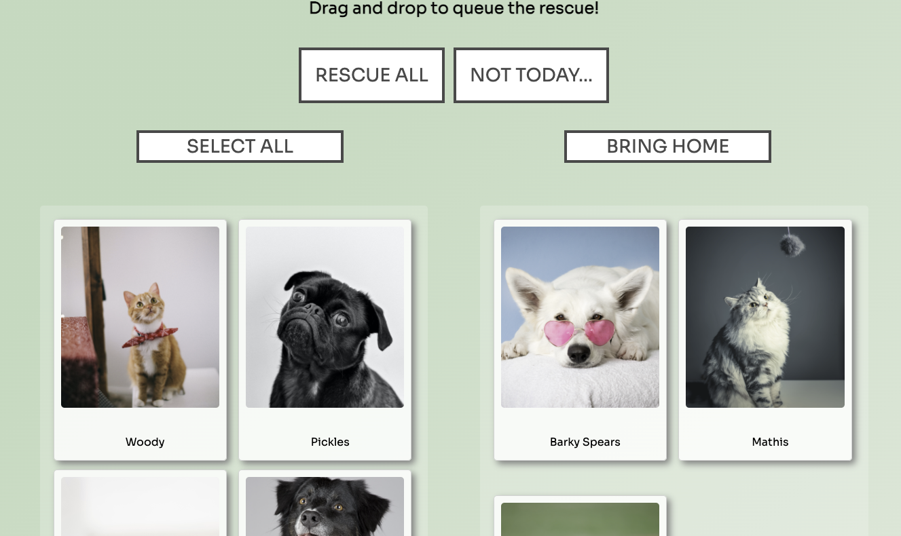
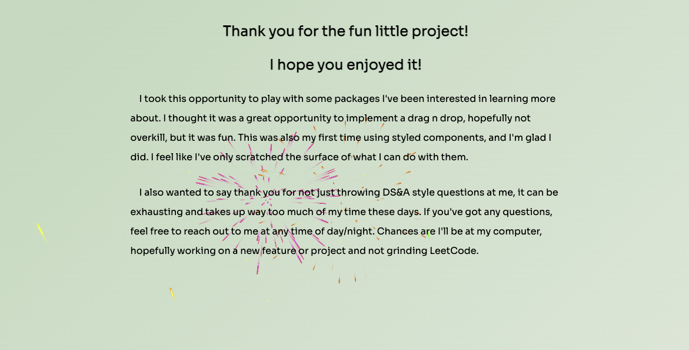

# Rescue the PETS!

### Thank you for the opportunity!

### Highlights
* MVP Requirements 
    - Made with Create React App
    - Used fetch to obtain data and store in Redux
    - Utilized buttons to select all or drag and drop one at a time
    - Clear all selections with a button
    - Search bar, filters by name or description
    - Utilized Styled Components
    - Utilized React-Router-Dom for navigation
    - React-Redux, only one fetch on app load
* Drag and drop

* Fireworks! 

* Reuseable Components
    - Pet Profile, used on profile and Modal
* Resuseable Styles
    - Styled Components are great!
* Mobile Responsive